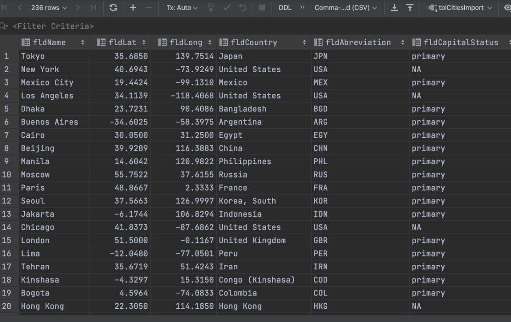
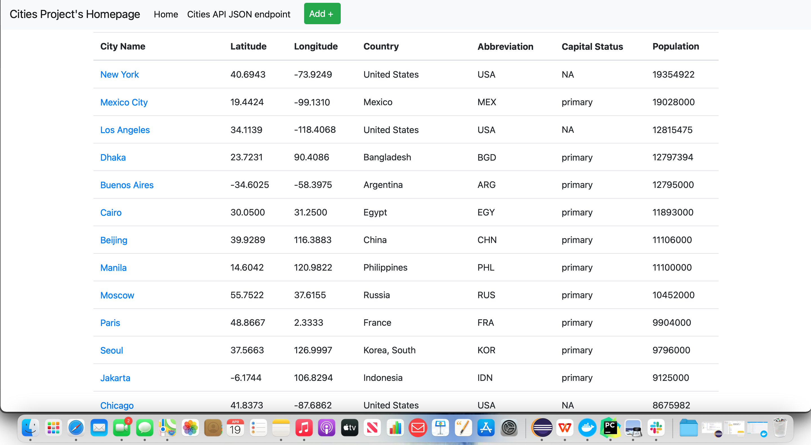
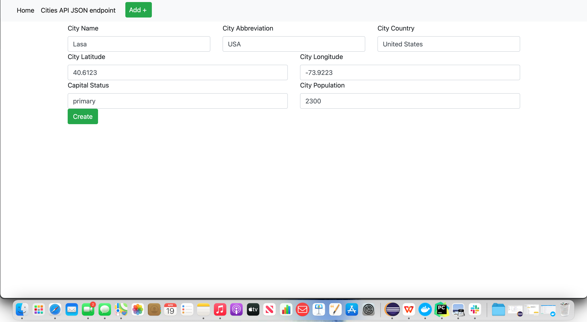
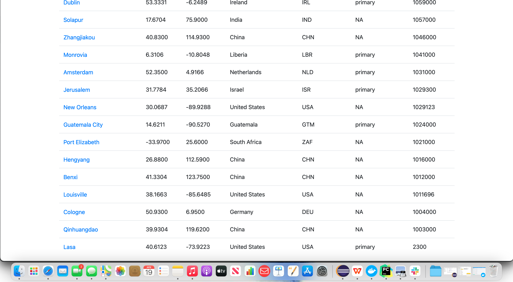
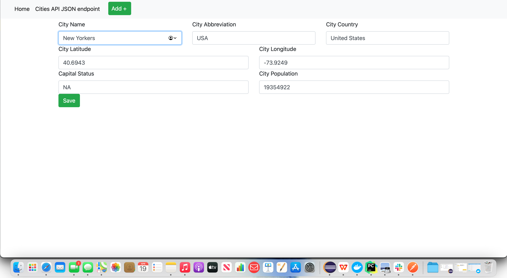
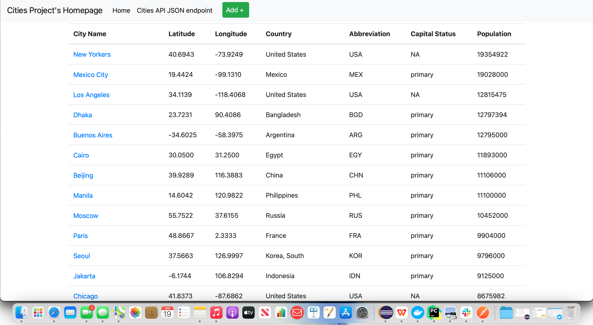
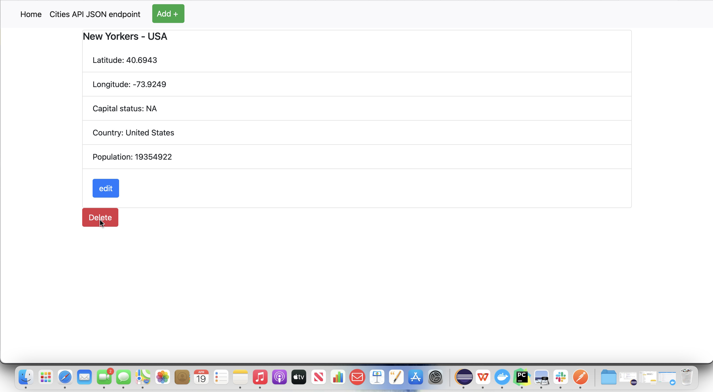
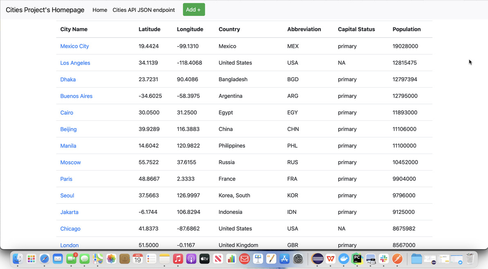

# Project Description
This project is a homework assignment to teach how to get Pycharm setup with Docker, Flask, MySQL, and Postman

## Screenshots
a) The project showing that you can view YOUR data tables in pycharm.

b)Project running correctly in the browser displaying your homepage with your data

c)Project running correctly in the browser displaying your data record as a view of one record

d)Project running correctly in the browser displaying a new record added to your home page

e)Project running correctly in the browser displaying an updated record added to your home 
page

f)Project running correctly in the browser displaying a deleted record added to your home 
page

