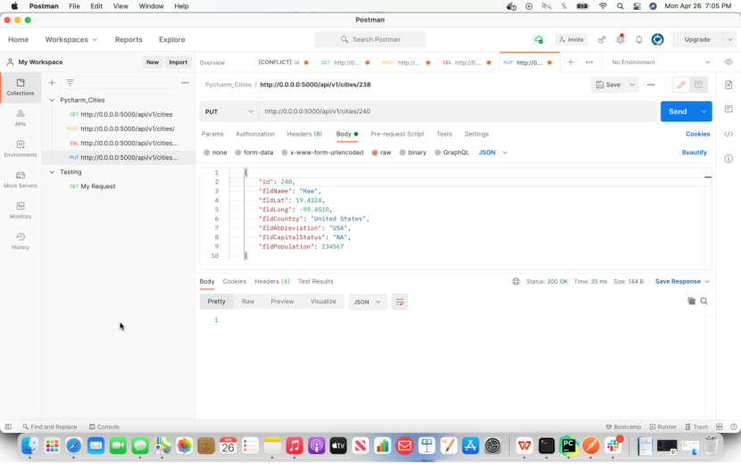

# Project Description
This project is a homework assignment to teach how to get Pycharm setup with Docker, Flask, MySQL, and Postman

## Screenshots
a) Postman listing all records.

b)Postman showing one record with a get request.

c)Postman creating a record by showing the post request and the results in the record listing.

d)Postman edit a record by showing the put request and the results in the record listing.

e)Postman delete a record by showing the delete request and the results in the record listing.

